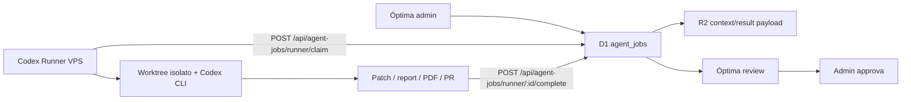

# Óptima Agentic Runner

Óptima può orchestrare job operativi agentici senza esporre il VPS a internet.

## Architettura



## Perche polling outbound

Il VPS Hostinger ospita gia altri servizi. Per evitare collisioni con Hermes o processi esistenti, il runner non apre porte pubbliche:

- legge job con polling HTTPS verso Óptima;
- usa bearer token `AGENT_RUNNER_API_KEY`;
- lavora in directory isolate;
- restituisce solo risultato e artifact metadata;
- non fa deploy automatici senza approvazione.

## Tabelle D1

Migration: `migrations/0015_agent_jobs.sql`

- `agent_jobs`: coda e stato dei job.
- `agent_job_events`: audit trail.
- `agent_job_artifacts`: report, PDF, PR, patch o link prodotti.

## API

### Admin

- `GET /api/agent-jobs`
- `POST /api/agent-jobs`
- `GET /api/agent-jobs/:id`
- `PATCH /api/agent-jobs/:id`

Azioni PATCH:

- `approve`
- `reject`
- `cancel`

### Runner

Header richiesto:

```http
Authorization: Bearer $AGENT_RUNNER_API_KEY
```

Claim:

```bash
curl -X POST "$OPTIMA_URL/api/agent-jobs/runner/claim" \
  -H "Authorization: Bearer $AGENT_RUNNER_API_KEY" \
  -H "Content-Type: application/json" \
  -d '{"runnerId":"hostinger-codex-01"}'
```

Complete:

```bash
curl -X POST "$OPTIMA_URL/api/agent-jobs/runner/$JOB_ID/complete" \
  -H "Authorization: Bearer $AGENT_RUNNER_API_KEY" \
  -H "Content-Type: application/json" \
  -d '{
    "runnerId":"hostinger-codex-01",
    "status":"needs_review",
    "resultSummary":"Patch pronta e PR creata.",
    "artifacts":[
      {"type":"pull-request","label":"PR GitHub","url":"https://github.com/.../pull/1"}
    ]
  }'
```

## Runner VPS pronto

Nel repository ora c'e un runner pronto in `runner/`:

- `runner/optima-agent-runner.mjs`: polling, workspace isolato, Codex CLI, complete callback.
- `runner/optima-agent-runner.service`: template systemd.
- `runner/env.example`: variabili richieste.
- `runner/README.md`: installazione Hostinger.

Processo systemd con loop:

1. chiama `claim`;
2. se riceve `null`, dorme 20-60 secondi;
3. crea worktree in `/srv/optima-agent/jobs/$JOB_ID`;
4. clona o aggiorna repo;
5. esegue Codex CLI o tool dedicato;
6. produce artifact;
7. chiama `complete`.

Regole operative:

- mai scrivere secret nei log;
- timeout per job;
- massimo 1-2 job concorrenti sul VPS se ospita altri servizi;
- cleanup worktree dopo review o dopo N giorni;
- PR/patch prima del deploy;
- deploy solo con job esplicito e approvazione admin.
- selezionare subagente, provider e tool dal control plane, non da preferenze hardcoded nel runner.
- per provider locali come Gemma/OpenCode, il runner espone solo capability e health; Optima resta responsabile di tenant, permessi, audit e review.

## Subagenti e tool lane

Il runner puo eseguire piu profili agentici, ma ogni profilo resta dichiarato in `agent_subagents`:

- `code`: Codex/OpenCode con GitHub, Cloudflare, Vercel, Hostinger.
- `research`: Qwen/OpenAI con repository, fonti e knowledge graph.
- `media`: MiniMax/Cloudinary con asset collegati a cliente/campagna/task.
- `operations`: Gemma/OpenAI con SendGrid, Telegram, rapportini e task.

Il runner non decide autonomamente quali integrazioni usare: riceve dal job una lane e un context bundle. Se mancano provider o MCP richiesti, deve restituire `needs_review` con una richiesta di installazione guidata.

## Variabili Cloudflare

Secret da configurare su staging e production:

```bash
npx wrangler secret put AGENT_RUNNER_API_KEY --env staging
npx wrangler secret put AGENT_RUNNER_API_KEY --env production
npx wrangler secret put AGENT_RUNNER_ENABLED --env staging
npx wrangler secret put AGENT_RUNNER_ENABLED --env production
```

`AGENT_RUNNER_ENABLED` deve valere `true` per reclamare job. Se manca o contiene un altro valore, il runner puo registrare heartbeat e polling, ma `/api/agent-jobs/runner/claim` risponde con `job: null` e `suspended: true`.

## Setup rapido Hostinger

Sul VPS:

```bash
sudo mkdir -p /srv/optima-agent
sudo chown -R "$USER":"$USER" /srv/optima-agent
git clone https://github.com/axelfleureau/optima-beta.git /srv/optima-agent/optima-beta
cp /srv/optima-agent/optima-beta/runner/env.example /srv/optima-agent/optima-runner.env
chmod 600 /srv/optima-agent/optima-runner.env
```

Poi inserisci in `/srv/optima-agent/optima-runner.env` lo stesso valore configurato in Cloudflare per `AGENT_RUNNER_API_KEY`.

Avvio:

```bash
sudo cp /srv/optima-agent/optima-beta/runner/optima-agent-runner.service /etc/systemd/system/optima-agent-runner.service
sudo systemctl daemon-reload
sudo systemctl enable --now optima-agent-runner
journalctl -u optima-agent-runner -f
```

Il runner deve restare piccolo, osservabile e riavviabile. La potenza agentica sta nel protocollo e nel controllo umano, non in un processo opaco che fa tutto da solo.
